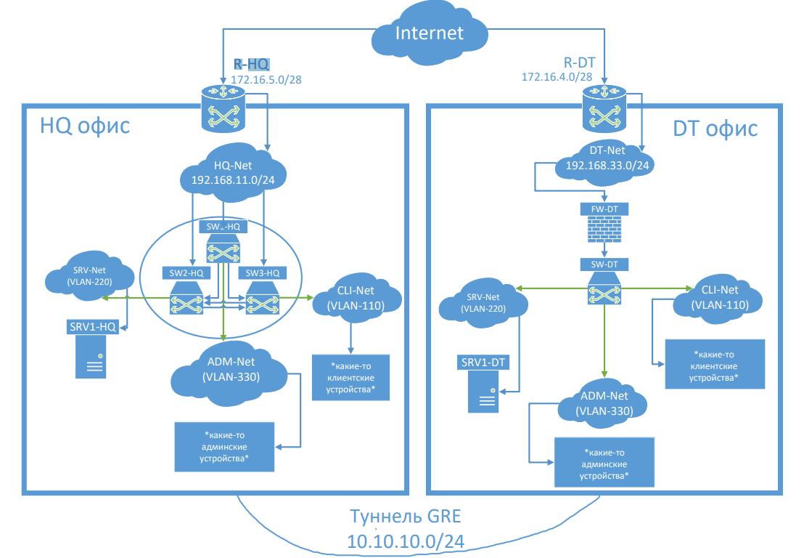

# Модуль Б (Настройка технических и программных средств информационно-коммуникационных систем)



<table>
    <tr>
        <th>Название</th>
        <th>ОС</th>
    </tr>
    <tr>
        <td>R-HQ</td>
        <td>Alt linux Server 10</td>
    </tr>
    <tr>
        <td>R-DT</td>
        <td>Alt linux Server 10</td>
    </tr>
    <tr>
        <td>SW1-HQ</td>
        <td>Alt linux Server 10</td>
    </tr>
    <tr>
        <td>SW2-HQ</td>
        <td>Alt linux Server 10</td>
    </tr>
    <tr>
        <td>SW3-HQ</td>
        <td>Alt linux Server 10</td>
    </tr>
    <tr>
        <td>SRV1-HQ</td>
        <td>Alt linux Server 10</td>
    </tr>
    <tr>
        <td>FW-DT</td>
        <td>Alt linux Server 10</td>
    </tr>
    <tr>
        <td>SW-DT</td>
        <td>Alt linux Server 10</td>
    </tr>
    <tr>
        <td>SRV1-DT</td>
        <td>Alt linux Server 10</td>
    </tr>
</table>

### HQ офис

| Подсеть/VLAN | Префикс | Диапазон | Размер |
|:-|:-|:-|:-|
| 192.168.11.0 / vlan110 |/24 | 192.168.11.2-66 | 64 |
| 192.168.11.100 / vlan220 | /24 | 192.168.11.100-116 | 16 |
| 192.168.11.200 / vlan330 | /24 | 192.168.11.200-208 | 8 |

### DT офис

| Подсеть/VLAN | Префикс | Диапазон | Размер |
|:-|:-|:-|:-|
| 192.168.33.0 / vlan110 |/24 | 192.168.33.2-66 | 64 |
| 192.168.33.100 / vlan220 | /24 | 192.168.33.100-116 | 16 |
| 192.168.33.200 / vlan330 | /24 | 192.168.33.200-208 | 8 |

### Внеполосное управление виртуалками в Proxmox (на всякий)

<details>
  <summary>Нажми сюда))</summary>
  
Добавление serial порта в Гипервизоре:
```
qm set <VM ID> -serial0 socket
```
Хост `/etc/init/ttyS0.conf`:
```
# ttyS0 - getty
start on stopped rc RUNLEVEL=[12345]
stop on runlevel [!12345]
respawn
exec /sbin/getty -L 115200 ttyS0 vt102
```
Конфигурация `grub` `/etc/default/grub`:
```
GRUB_CMDLINE_LINUX ='console=tty0 console=ttyS0,115200'
```
Update:
```
update-grub
```
Включение serial порта:
```
systemctl enable serial-getty@ttyS0.service
```
Перезагружаемся и заходим через `xterm.js`. Теперь доступны скроллинг, вставка, копирование и произвольный размер окна.

</details>

## Базовая настройка Alt Linux


<details>
  <summary>Установка имени ВМ</summary>

### Установка имени ВМ

(через рут)
```
hostnamectl set-hostname имя_пк
```

После этого выходим из системы или перезагружаемся.

Для проверки корректности установки имени ПК выполнить команду:
```bash
hostnamectl
# или
hostname
# или
cat /etc/hostname
```
</details>

<details>
<summary>Создание пользователя:</summary>

### Создание пользователя:

```bash
useradd -m -G wheel -s /bin/bash sshuser
```

Установка пароля:

```
passwd sshuser
P@ssw0rd
P@ssw0rd
```

Изменить права доступа к файлу `/etc/sudoers`:
```bash
chmod 600 /etc/sudoers
```
затем открыть файл в текстовом редакторе (vim, mcedit или nano) и раскомментировать строку: `WHEEL_USERS ALL=(ALL:ALL) NOPASSWD: ALL` для запуска утилиты sudo без дополнительной аутентификации. 

или выполнить команду:
```bash
echo "sshuser ALL=(ALL) NOPASSWD: ALL" >> /etc/sudoers
```
</details>


<details>
  <summary>Настройка SSH</summary>

### Настройка SSH

### Установка SSH сервера

```bash
apt-get install openssh-server -y

systemctl enable --now sshd
```

На сервере, к которому подключаемся
```bash
cd /home/sshuser
mkdir -p .ssh/
chmod 700 .ssh/
touch .ssh/authorized_keys
chmod 600 .ssh/authorized_keys
chown sshuser:sshuser .ssh/authorized_keys
```

Клиентская машина, с которой подключаемся
```bash
ssh-keygen -t rsa -b 2048 -f srv_ssh_key
mkdir ~/.ssh
mv srv_ssh_key* .ssh/
```

Конфиг для автоматического подключения (пример, т.к. айпи серверов могут отличаться) `.ssh/config`:
```
Host srv-hq
        HostName 192.168.11.100
        User sshuser
        IdentityFile .ssh/srv_ssh_key
        Port 22
Host srv-br
        HostName 192.168.33.100
        User sshuser
        IdentityFile .ssh/srv_ssh_key
        Port 22
```

```bash
chmod 600 .ssh/config
```
Копирование ключа на удаленный сервер:
```bash
ssh-copy-id -i .ssh/srv_ssh_key.pub sshuser@192.168.11.100
```
```bash
ssh-copy-id -i .ssh/srv_ssh_key.pub sshuser@192.168.33.100
```

На сервере `/etc/ssh/sshd_config`:
```
AllowUsers sshuser
PermitRootLogin no
PubkeyAuthentication yes
PasswordAuthentication no
AuthorizedKeysFile .ssh/authorized_keys
Port 22
```
перезапускаем службу:
```bash
systemctl restart sshd
```
Подключение:
```
ssh srv-hq
```
</details>


## Настройка роутера на базе Alt Linux

<details>
  <summary>Настройка роутера R-HQ</summary>

### Настройка роутера R-HQ

#### Конфигурация VM
Нужно дать ВМ 2 сетевых адаптера:

1) Для внешней сети (enp0s3)
2) Для внутр. сети (enp0s8)

<b>Внимание: название сетевых адаптеров в вашем случае может отличаться!!</b>

Первым делом нужно настроить IP адрес от провайдера, в нашем случае, это `172.16.5.15` в сети `172.16.5.0/28`, где 16 доступных адресов для адресации. Таким образом, нам нужен старший адрес, которым является `15`.

```
vim /etc/net/ifaces/enp0s3/options
```
```
TYPE=eth
DISABLED=no
NM_CONTROLLED=no
BOOTPROTO=static
CONFIG_IPV4=YES
```
```bash
echo "172.16.5.15/28" > /etc/net/ifaces/enp0s3/ipv4address
```
```bash
echo "default via 172.16.5.1" > /etc/net/ifaces/enp0s3/ipv4route
```


#### Конфигурация DHCP-сервера
Установка DHCP-сервера
```bash
su-
apt-get update
apt-get install dhcp-server -y
```
#### 1) На втором сетевом адаптере (enp0s8) настроить ip адрес:
В директории `/etc/net/ifaces/enp0s8` (если нет, то создать командой: `mkdir /etc/net/ifaces/enp0s8`)

Затем в директории создать файл с кофнигурацией ip адреса: `ipv4address`:
```bash
echo "192.168.11.1/24" > /etc/net/ifaces/enp0s8/ipv4address
```

Создаем файл `options` с содержимым:
```
TYPE=eth
DISABLED=no
NM_CONTROLLED=no
BOOTPROTO=static
CONFIG_IPV4=YES
```

Перезапускаем сетевую службу:
```
systemctl restart network
```

#### 2) настраиваем DHCP-сервер
В файле `/etc/dhcp/dhcpd.conf`
```
ddns-update-style none;

subnet 192.168.11.0 netmask 255.255.255.0 { #сеть и маска подсети
        option routers                  192.168.11.1; #адрес маршрутизатора
        option subnet-mask              255.255.255.0; #маска подсети

        option domain-name              "au.team"; #домен
        option domain-name-servers      8.8.8.8; #DNS-сервера для клиентов

        range dynamic-bootp 192.168.11.2 192.168.11.254; #диапазон DHCP-подсети

        #стандартное и максимальное время аренды (в секундах)
        #6 часов
        default-lease-time 21600;
        #12 часов
        max-lease-time 43200;
}
```

В файле `/etc/sysconfig/dhcpd` указать сетевой адаптер, на котором идет раздача ip адресов (enp0s8)
```
# The following variables are recognized:

DHCPDARGS=enp0s8

# Default value if chroot mode disabled.
#CHROOT="-j / -lf /var/lib/dhcp/dhcpd/state/dhcpd.leases"
```

Запускаем службу dhcp-сервера (из под рута):
```
systemctl enable dhcpd --now
```

Проверям работу:
```
systemctl status dhcpd
```

#### 3) Настройка маршрутизации между двумя сетевыми картами

#### Включаем IP Forwarding
В файле `/etc/net/sysctl.conf` ставим значение строки `net.ipv4.ip_forward` в 1
```
net.ipv4.ip_forward = 1
```

Применяем настройки вручную:
```
sysctl -p /etc/net/sysctl.conf
```

или перезапускаем машину, проверяем IP Forwarding командой
```
sysctl net.ipv4.ip_forward
```
Правильным значением вывода этой команды должно быть:
```
net.ipv4.ip_forward = 1
```

#### Настраиваем NAT (маскарадинг)
Разрешаем трафик из локальной сети через интерфейс с интернетом:
```
iptables -t nat -A POSTROUTING -o enp0s3 -j MASQUERADE
iptables -A FORWARD -i enp0s8 -o enp0s3 -j ACCEPT
iptables -A FORWARD -i enp0s3 -o enp0s8 -m state --state RELATED,ESTABLISHED -j ACCEPT
```

Сохранение конфигурации
```
iptables-save >> /etc/sysconfig/iptables
```

Запускаем службу iptables:
```
systemctl enable iptables.service --now
```
и проверяем службу iptables командой: `systemctl status iptables.service`

#### Перезапуск виртуальной машины роутера:
```
reboot
```

</details>


<details>
  <summary>Настройка роутера R-DT</summary>

### Настройка роутера R-DT

Настройка аналогична настройке роутера R-HQ за исключением конфигурации входящей и выходящей сетей. 

<b>Внимание: название сетевых адаптеров в вашем случае может отличаться!!</b>

Первым делом нужно настроить IP адрес от провайдера, в нашем случае, это `172.16.4.15` в сети `172.16.4.0/28`, где 16 доступных адресов для адресации. Таким образом, нам нужен старший адрес, которым является `15`.

```
vim /etc/net/ifaces/enp0s3/options
```
```
TYPE=eth
DISABLED=no
NM_CONTROLLED=no
BOOTPROTO=static
CONFIG_IPV4=YES
```
```bash
echo "172.16.4.15/28" > /etc/net/ifaces/enp0s3/ipv4address
```
```bash
echo "default via 172.16.4.1" > /etc/net/ifaces/enp0s3/ipv4route
```

```bash
echo "192.168.33.1/24" > /etc/net/ifaces/enp0s8/ipv4address
```

В файле `/etc/dhcp/dhcpd.conf`
```
ddns-update-style none;

subnet 192.168.33.0 netmask 255.255.255.0 { #сеть и маска подсети
        option routers                  192.168.33.1; #адрес маршрутизатора
        option subnet-mask              255.255.255.0; #маска подсети

        option domain-name              "au.team"; #домен
        option domain-name-servers      8.8.8.8; #DNS-сервера для клиентов

        range dynamic-bootp 192.168.33.2 192.168.33.254; #диапазон DHCP-подсети

        #стандартное и максимальное время аренды (в секундах)
        #6 часов
        default-lease-time 21600;
        #12 часов
        max-lease-time 43200;
}
```

</details>